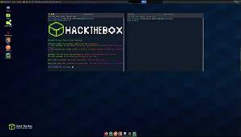

# La distribution

## Qu'est-ce que parrot-os ? 

Parrot OS est une distribution Linux basée sur Debian, apparue en 2013. Celle-ci est disponible pour les archiectures de processeurs x86-64 et ARM. 
Cette distribution utilise l'environnement de bureau MATE. 

<b style="color:green">Parrot-OS</b> se décline en plusieurs éditions : 
1. Parrot Security : cette version de <b style="color:green">Parrot-OS</b> propose nativement un grand panel d'outil utilisé pour de la reconnaissance de vulnérabilité, et l'exploitation de celles-ci.
2. Parrot Home : Cette édition de <b style="color:green">Parrot-OS</b> est designée afin de l'utiliser au quotidien. C'est un système plus léger, plus facile à prendre en main, sans toute les préconfiguration que l'on pourrait retrouver sur la partie Security
3. Parrot ARM : C'est l'édition conçue pour les système possèdant un processeur ARM ( en particulier les raspberry PI ). Celle-ci peut possèder un grand nombre d'outil, que l'on peut retrouver dans l'édition Security, à condition que ceux-ci soient aussi compliés pour des processeurs ARM.

## Pourquoi Parrot-OS 

<b style="color:green">Parrot-OS</b> est, comme la distribution concurrente <b style="color:cyan">Kali-Linux</b>, une distribution possèdant des outils préinstallé permettant aux personnes travaillant dans la cybersécurité de ne pas avoir à refaire une configuration complète de ces outils qui, avouons le, sont un poil rébarbatifs et contraignants à installer. 

De plus, nous pourrons y retrouver beaucoup de ressources disponibles par défaut sur la machine ( POC d'exploit, Seclistes, scripts de recherche de vulnérabilités, etc... ). Cela nous évite donc d'avoir à télécharger des ressources assez lourdes, afin de nous économiser du temps.

Enfin, <b style="color:green">Parrot-OS</b> est surtout pratique par le fait qu'il est disponible, comme <b style="color:cyan">Kali-Linux</b> sous plusieurs formes ( iso, machine virtuelle préconfigurée, édition cloud ) afin de pouvoir gagner du temps lors du déploiement. La plateforme HackTheBox met à disposition, sur une durée plus ou moins limitée, une machine virtuelle sous Parrot OS nommée "PwnBox". C'est cet ISO que j'ai décidé d'installer. 

Pour la Security Edition, voici le matériel requis : 
|Type| Valeure|
|:-:|:-|
| Processeur | Dual Core |
|GPU | Non-nécessaire ***( sauf si besoin de bruteforce avec hashcat )***|
|RAM | 1 GB minimum| 
|Stockage |20GB minimum| 


[Site Officiel PARROT-OS](https://www.parrotsec.org/)




# Outil : enum4linux

Enum4linux est un célèbre outil utilisée lors de la phase de reconnaissance en pentest / CTF. Celui-ci est installé par defaut sur Parrot-OS. 
Cet outil va nous permettre d'obtenir des informations sur la machine scannée ( OS, utilisateurs connus, partages, etc... )

Enum4linux s'utilise comme cela : `enum4linux [options] ip`

```bash 
┌──(tomweber-ParrotOS)-[~/Documents/htb/Box/Blackfield]  
└─$ enum4linux 10.10.10.100
```
Output : 

```text
Starting enum4linux v0.9.1 ( http://labs.portcullis.co.uk/application/enum4linux/ ) on Fri Dec  9 06:56:47 2022  
  
=========================================( Target Information )=========================================  
  
Target ........... 10.10.10.100  
RID Range ........ 500-550,1000-1050  
Username ......... ''  
Password ......... ''  
Known Usernames .. administrator, guest, krbtgt, domain admins, root, bin, none  
  
  
============================( Enumerating Workgroup/Domain on 10.10.10.100 )============================  
  
  
[E] Can't find workgroup/domain  
  
  
  
================================( Nbtstat Information for 10.10.10.100 )================================  
  
Looking up status of 10.10.10.100  
No reply from 10.10.10.100  
  
===================================( Session Check on 10.10.10.100 )===================================  
  
  
[E] Server doesn't allow session using username '', password ''.  Aborting remainder of tests.  
  
                                                                                                                                                            
┌──(tomweber㉿kali)-[~/Documents/htb/Box/Blackfield]  
└─$ sudo enum4linux 10.10.10.100  
[sudo] password for tomweber:    
Starting enum4linux v0.9.1 ( http://labs.portcullis.co.uk/application/enum4linux/ ) on Fri Dec  9 06:57:30 2022  
  
=========================================( Target Information )=========================================  
  
Target ........... 10.10.10.100  
RID Range ........ 500-550,1000-1050  
Username ......... ''  
Password ......... ''  
Known Usernames .. administrator, guest, krbtgt, domain admins, root, bin, none  
  
  
============================( Enumerating Workgroup/Domain on 10.10.10.100 )============================  
  
  
[E] Can't find workgroup/domain  
  
  
  
================================( Nbtstat Information for 10.10.10.100 )================================  
  
Looking up status of 10.10.10.100  
No reply from 10.10.10.100  
  
===================================( Session Check on 10.10.10.100 )===================================  
  
  
[+] Server 10.10.10.100 allows sessions using username '', password ''  
  
  
================================( Getting domain SID for 10.10.10.100 )================================  
  
do_cmd: Could not initialise lsarpc. Error was NT_STATUS_ACCESS_DENIED  
  
[+] Can't determine if host is part of domain or part of a workgroup  
  
  
===================================( OS information on 10.10.10.100 )===================================  
  
  
[E] Can't get OS info with smbclient  
  
  
[+] Got OS info for 10.10.10.100 from srvinfo:    
       10.10.10.100   Wk Sv PDC Tim NT     Domain Controller  
       platform_id     :       500  
       os version      :       6.1  
       server type     :       0x80102b  
  
  
=======================================( Users on 10.10.10.100 )=======================================  
  
  
[E] Couldn't find users using querydispinfo: NT_STATUS_ACCESS_DENIED  
  
  
  
[E] Couldn't find users using enumdomusers: NT_STATUS_ACCESS_DENIED  
  
  
=================================( Share Enumeration on 10.10.10.100 )=================================  
  
do_connect: Connection to 10.10.10.100 failed (Error NT_STATUS_RESOURCE_NAME_NOT_FOUND)  
  
       Sharename       Type      Comment  
       ---------       ----      -------  
       ADMIN$          Disk      Remote Admin  
       C$              Disk      Default share  
       IPC$            IPC       Remote IPC  
       NETLOGON        Disk      Logon server share    
       Replication     Disk         
       SYSVOL          Disk      Logon server share    
       Users           Disk         
Reconnecting with SMB1 for workgroup listing.  
Unable to connect with SMB1 -- no workgroup available  
  
[+] Attempting to map shares on 10.10.10.100  
  
//10.10.10.100/ADMIN$   Mapping: DENIED Listing: N/A Writing: N/A  
//10.10.10.100/C$       Mapping: DENIED Listing: N/A Writing: N/A  
//10.10.10.100/IPC$     Mapping: OK Listing: DENIED Writing: N/A  
//10.10.10.100/NETLOGON Mapping: DENIED Listing: N/A Writing: N/A  
//10.10.10.100/Replication      Mapping: OK Listing: OK Writing: N/A  
//10.10.10.100/SYSVOL   Mapping: DENIED Listing: N/A Writing: N/A  
//10.10.10.100/Users    Mapping: DENIED Listing: N/A Writing: N/A  
  
============================( Password Policy Information for 10.10.10.100 )============================  
  
  
[E] Unexpected error from polenum:  
  
  
  
[+] Attaching to 10.10.10.100 using a NULL share  
  
[+] Trying protocol 139/SMB...  
  
       [!] Protocol failed: Cannot request session (Called Name:10.10.10.100)  
  
[+] Trying protocol 445/SMB...  
  
       [!] Protocol failed: SMB SessionError: STATUS_ACCESS_DENIED({Access Denied} A process has requested access to an object but has not been granted t  
hose access rights.)  
  
  
  
[E] Failed to get password policy with rpcclient  
  
  
  
=======================================( Groups on 10.10.10.100 )=======================================  
  
  
[+] Getting builtin groups:  
  
  
[+]  Getting builtin group memberships:  
  
  
[+]  Getting local groups:  
  
  
[+]  Getting local group memberships:  
  
  
[+]  Getting domain groups:  
  
  
[+]  Getting domain group memberships:  
  
  
==================( Users on 10.10.10.100 via RID cycling (RIDS: 500-550,1000-1050) )==================  
  
  
[E] Couldn't get SID: NT_STATUS_ACCESS_DENIED.  RID cycling not possible.  
  
  
===============================( Getting printer info for 10.10.10.100 )===============================  
  
do_cmd: Could not initialise spoolss. Error was NT_STATUS_ACCESS_DENIED  
  
  
enum4linux complete on Fri Dec  9 06:58:19 2022
```

On peut donc trouver grâce à cet outil, que les sessions null ( user : '' , passowrd : '' ) sont autorisées sur cette machine. Il a ensuite pu utiliser cette session pour lister un grand nombre d'information sur la machine ( partages smb, domaine, le type d'OS et sa version, etc... )